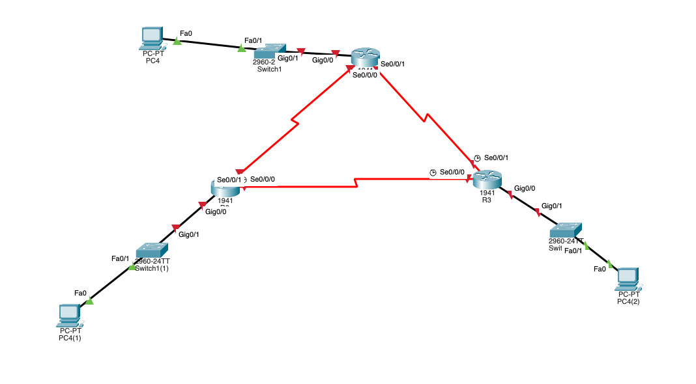

라우팅

라우팅 테이블에 적혀있는대로, 패킷을 보냄.
라우팅 테이블에 없는 경우, 패킷은 버려짐

라우팅 프로토콜 -> 라우팅 테이블을 작성해줌

리모트 네트워크 -> 자기 에ㄱ
라우터 -> 리모트 네트워크에 대한 정보가 없으면, 모든 페킷들은 버려짐
라우팅 프로토콜
  - static : 라우터가 모르는 네트워크를 관리자가 알려줌_15장 ip 
    - key: 리모트 네트워크
    - 통신은 없음. 관리자가 알려주면, 그대로 실행(다른 길은 찾지 않음 / 통신이 되지 않아도, 그대로 통신을 보냄)
  - 다이나믹 : 라우터들끼리 통신해, 리모트 네트워크의 정보를 주고 받아, 최적의 경로를 찾아서, 통신을 주고 받는 방식
    - key: 내가 알고 있는 네트워크의 정보

* 실습
* 
  - 포트 추가시 전원은 off로 되어 있어야함
    - HWIC-2T -> 오른쪽에 넣는 것이 더욱 간단함
    - 전원 on
    - 라우터 스위치 pc 총 3개씩 생성
    - Serial(빨간 선 / 시계가 없는 선) 포트 기억해야함(ip지정을 해야함!!)
    - ip 할당
    - en / conf t / sh ip route (에서 c만 확인)
    [1] static (양쪽의 모두 알려주는 것 / 하나의 포트를 죽여버리면, 통신이 안됨 -> [단점]절대복종으로 설정 경로만 통신_우회경로 사용 X)
      * r1, r2, r3 설정
        - ip route 192.168.2.0 255.255.255.0 192.168.11.2 (sh ip route에서 's'에 해당하는 내용확인)
    [2] static Route (Default Route)
      : 룹이 생김(라우터 내에서 빙글빙글 도는 현상)
      * r1, r2, r3 설정
        -  ip route 0.0.0.0 0.0.0.0 s0/0/0
        -  ip route 0.0.0.0 0.0.0.0 'ip' (윗줄과 동일)
      * pc에서 확인
        - tracert 'ip'
    [3] RIP
      * 작은 네트워크에서는 사용하나, 큰 네트워크에서는 사용하지 않음!!
      * 자기가 아는 네트워크만 꺼내면 끝!
      * setting (모든 라우터에서 실행_연결된 네트워크 전부 실행해야 통신이 이루어짐)
        - en / conf t / router rip
        - network '연결된 네트워크' (전부 입력)
        - do show ip routev ('r', 'c'의 갯수가 네트워크의 갯수)
    [4] EIGR
      * cisco 제품이 아니면 사용할 수 없음 // 빠르기는 가장 빠름
      * [3]과 비슷하나, 프로세스 id를 줘야함
      * 서브넷 마스크 같은 것을 사용하나, 서브넷 마스크가 아닌, 와일드 카드 마스크
      * 와일드 카드 = 서브넷 마스크를 뒤집어 놓은것(255.255.255.0 -> 0.255.255.255)
        - en / conf t / router eigrp 10
        - net 'ip' 0.0.0.255 (전부 입력)
        - 연결된 경우 이와 같은 msg가 나옴// %DUAL-5-NBRCHANGE: IP-EIGRP 10: Neighbor 192.168.11.1 (Serial0/0/0) is up: new adjacency 
    [5] OSPF (오픈 가장 짧은 길을 선택한다) // 원래 방법은 3가지가 있으나, 이 방법으로 해야 [4]과 햇갈리지 않음
      * 느린 것은 아니나, 리소스 소모가 심함
      * 통신이 많음 -> 라우팅이 늘어날 수록 통신이 매우 많이 늘어남
      * 그러므로, 영역을 나눠 대표만 통신을 진행
      * 영역은 모두 0번이 되고, 설정은 0번만 하면됨
      * 보안 상 라우팅을 제거할 경우, 해당 ip를 제외 -> 인터넷은 안되나, 통신은 가능함! (private 통신)
        - en / conf t / router ospf 10
        - net 192.168.1.0 0.0.0.255(ip주소 모두 연결) area 0 // == net 192.168.1.0 0.0.0.255 a 0 
        - 연결 시 msg // 00:38:53: %OSPF-5-ADJCHG: Process 10, Nbr 192.168.13.1 on Serial0/0/0 from LOADING to FULL, Loading Done

// ran 구간은 10.1.1.0 /30 | /30은 255.255.255.252
 - 10.1.1.1
 - 10.1.1.2
- 이경우 와일드 마스크는
  255.255.255.255 - 서브넷마스크
  255.255.255.252
-   0.  0.  0.  3 - 와일드 마스크

ex: 10.1.1.4 /30 의 경우
- 사용할 수 있는 ip주소 : 10.1.1.5 , 10.1.1.6

루트 섬머링
플러팅
HSRP
보안
라우팅
