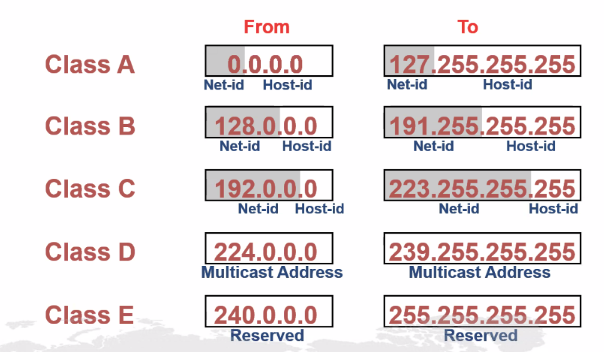

# 2주차
* mac주소 및 2계층

* 0~255.0~255.0~255.0~255
  - ip는 앞에서부터 해석
  - DNS는 뒤에서부터 해석

* ip의 맨 앞자리 
  - 0 ~ 127: A class / 8bit 마스킹: 255.0.0.0
    - 10.0.0.0 ~ 10.255.255.255
  - 128~191: B class / 16bit 마스킹: 255.255.0.0
    - 172.16.0.0 ~ 172.31.255.255
  - 192~223: C class / 24bit 마스킹: 255.255.255.0
    - 192.168.0.0 ~ 192.168.255.255
  - 224~239: D class / 멀티캐스터용(1:특정 그룹 = 같은 멀티캐스터 주소를 사용하는 구룹)으로 사용: 255.255.255.0
    - 192.168.0.0 ~ 192.168.255.255
  - 240~255: E class / 예비용 

* 서브네팅: 기본보다 더 높은 class를 사용하는 것

* ipv6(128bit)가 나온 이유: ipv4(32bit)가 고갈이 되어서
  -> private ip: 주소는 유일 해야하나, 중복을 허락해주며,  / 라우팅이 불가능.. -> 인터넷이 안됨..
  -> NAT -> 공유기
  + 인터넷과 통신은 실제의 IP하나로(공유기), 공유기 내에서는 NAT기술을 이용하여 구분.
  + 같은 그룹은 같은 라우터 아래에 있어야, 통신이 가능 + 다른 그룹은 다른 라우터 아래에 있어야 통신이 가능!

* 네트워크의 구분 방법 **중요**
    - 192.168.1.11/24 -> 255.255.255.0 => 192.168.1.0 (N 주소)
    - 192.168.1.13 => 192.168.1.0 (N 주소)
    - 192.168.2.11 => 192.168.2.0 (N 주소)
  - 위의 정보로는 알아낼 수 없음. ?.?.?.?/bit
  - 서브넷팅 / 슈퍼넷팅

* 라우터 / 스위치 : 일반 컴퓨터와 같음. 하드디스크는 없음(프레시 메모리, USB 등으로 대체). 입/출력 장치도 없음(일반 컴퓨터를 빌려서, 작업을 해야함)
  - Power On -> 하드웨어 체크(Power On Self Test)
  - 부팅정보를 찾음a
  + nvRam -> startUp(config 파일) -> 이 파일을 지우면 공장 초기화
  + runngin configration 파일(운영되고 있는 파일)

* 컴퓨터 - 라우터 : 콘솔 선으로 연결 -> pc의 터미널에서 라우터와 같은 화면을 볼 수 있음
  * 기본 상태: 사용자 모드
  * enable = en : 특권모드 = 이네이블 모드 (? 시 사용 할 수 있는 명령어들이 나옴)
    - configure terminal = conf t
      - hostname R1 : 호스트의 이름을 변경
      - show running-config
      - show startup-config
      - copy run start
      - do sh vlan
  * disable: 사용자모드
